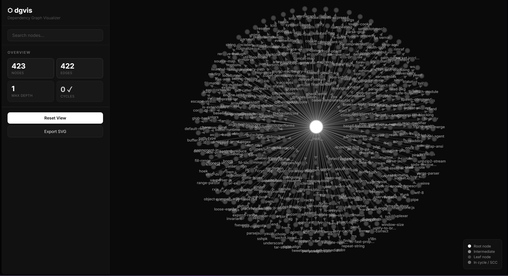

# dgvis — Dependency Graph Visualizer

A CLI tool that parses dependency files from real projects, builds directed graphs, detects circular dependencies, and visualizes them as interactive force-directed graphs. Built from scratch with zero graph library dependencies.

## Features

- **Interactive Web Dashboard** — D3.js force-directed graph with drag, zoom, search, and SVG export
- **Multi-format parsing** — `requirements.txt`, `package.json`/`package-lock.json`, `go.mod`, `Cargo.toml`, `Gemfile`, `pom.xml`, custom YAML
- **Cycle detection** — Iterative DFS with back-edge tracking, handles 10,000+ node graphs
- **Strongly connected components** — Tarjan's algorithm finds tightly-coupled clusters
- **Topological sorting** — Kahn's algorithm for build-order resolution
- **Multiple export formats** — Graphviz DOT, JSON, ASCII tree
- **Plugin architecture** — Register custom parsers via decorator or function call

---

## Getting Started

### Step 1: Install

```bash
git clone https://github.com/atikulmunna/dependency-visualizer.git
cd dependency-visualizer
pip install .
```

This installs `dgvis` as a global command — no `PYTHONPATH` setup needed.

### Step 2: Visualize Your Project

Point dgvis at **any dependency file** from a real project on your machine:

```bash
# Node.js project (best results — hundreds of deps)
dgvis web C:\path\to\your-project\package-lock.json

# Python project
dgvis web C:\path\to\your-project\requirements.txt

# Go project
dgvis web C:\path\to\your-project\go.mod
```

This opens an interactive graph dashboard in your browser at `http://127.0.0.1:8080`.

**Dashboard controls:**
- **Drag** any node to rearrange
- **Scroll** to zoom in/out
- **Click a node** to highlight its dependency chain
- **Type in the search box** to find specific packages
- **Export SVG** button to download the graph
- Press **Ctrl+C** in the terminal to stop the server

**Options:**
| Flag | Description |
|------|-------------|
| `--port 3000` or `-p 3000` | Use a different port |
| `--no-open` | Don't auto-open the browser |
| `--watch` or `-w` | Auto-reload when the file changes |



---

## All Commands

dgvis has 6 commands. All work with any supported file format.

### `dgvis analyze <file>` — Quick summary
```bash
python -m dgvis analyze C:\path\to\package.json

# Output:
# ─── Dependency Graph Analysis ───
#   Nodes       : 11
#   Edges       : 11
#   Cycles      : None ✓
```

### `dgvis visualize <file>` — Export graph
```bash
# ASCII tree (default)
python -m dgvis visualize C:\path\to\requirements.txt

# Graphviz DOT
python -m dgvis visualize deps.yaml -f dot -o graph.dot

# JSON
python -m dgvis visualize deps.yaml -f json -o graph.json
```

### `dgvis detect-cycles <file>` — Find circular deps
```bash
python -m dgvis detect-cycles C:\path\to\deps.yaml

# ⚠ Found 1 cycle(s):
#   1. service-a → service-b → service-c → service-a
```

### `dgvis stats <file>` — Detailed metrics
```bash
python -m dgvis stats C:\path\to\requirements.txt -v

# Shows topological order, per-node dep counts, etc.
```

### `dgvis scc <file>` — Find tightly-coupled clusters
```bash
python -m dgvis scc C:\path\to\deps.yaml

# ⚠ Found 1 tightly-coupled cluster(s):
#   1. [3 nodes] service-c ↔ service-b ↔ service-a
```

### `dgvis web <file>` — Interactive dashboard
```bash
dgvis web C:\path\to\package-lock.json
dgvis web C:\path\to\requirements.txt -p 3000 --no-open
dgvis web C:\path\to\Cargo.toml --watch   # auto-reload on changes
```

---

## Supported File Formats

| Ecosystem | File | What it parses |
|-----------|------|----------------|
| **Node.js** | `package-lock.json` | Full transitive dependency tree (best results) |
| **Node.js** | `package.json` | Direct deps + devDeps. Auto-uses lock file if present |
| **Python** | `requirements.txt` | Direct dependencies with version specifiers |
| **Go** | `go.mod` | Direct module dependencies |
| **Rust** | `Cargo.toml` | Dependencies, dev-dependencies, build-dependencies |
| **Ruby** | `Gemfile` | All gem declarations including groups |
| **Java** | `pom.xml` | Maven dependency artifacts |
| **Custom** | `*.yaml` / `*.yml` | Manual dependency graph definition |

### Custom YAML Format
```yaml
project: my-app
dependencies:
  app:
    - auth
    - database
  auth:
    - crypto
  database:
    - connection-pool
  crypto: []
  connection-pool: []
```

---

## Architecture

```
dgvis/
├── cli.py        → Click CLI with 6 commands
├── parser.py     → Format detection + 8 parsers + plugin registry
├── graph.py      → Node/Graph (adjacency list, no external libs)
├── analyzer.py   → DFS, Tarjan's SCC, topo sort, BFS depth
├── exporter.py   → DOT, JSON, ASCII tree renderers
├── web/          → D3.js dashboard + HTTP server
└── __main__.py   → python -m dgvis entry point
```

### Data Flow
```
Input File → Parser → {node: [deps]} → Graph → Analyzer / Exporter / Web UI
```

## Algorithms

| Algorithm | Use | Complexity |
|-----------|-----|------------|
| Iterative DFS | Cycle detection | O(V + E) |
| Tarjan's Algorithm | Strongly connected components | O(V + E) |
| Kahn's Algorithm | Topological sort | O(V + E) |
| BFS | Depth calculation | O(V + E) |

---

## Plugin Architecture

Register custom parsers for unsupported file formats:

```python
from dgvis.parser import registry

# Decorator form
@registry.register(extensions=[".lock"], filenames=["Pipfile.lock"])
def parse_pipfile_lock(filepath):
    # Return {parent: [dep1, dep2], ...}
    ...

# Imperative form
registry.register_parser(my_parser, extensions=[".toml"])
```

Plugins take priority over built-in parsers. Use `registry.clear()` to reset.

---

## CI Integration

### GitHub Action

Add to any repo's `.github/workflows/` to check dependencies on every push:

```yaml
name: Dependency Check
on: [push, pull_request]
jobs:
  check-deps:
    runs-on: ubuntu-latest
    steps:
      - uses: actions/checkout@v4
      - uses: actions/setup-python@v5
        with:
          python-version: '3.12'
      - run: pip install click pyyaml
      - run: |
          git clone --depth 1 https://github.com/atikulmunna/dependency-visualizer.git /tmp/dgvis
          PYTHONPATH=/tmp/dgvis python -m dgvis detect-cycles requirements.txt
```

### Pre-commit Hook

```bash
cp scripts/pre-commit-hook.sh .git/hooks/pre-commit
chmod +x .git/hooks/pre-commit
```

---

## Testing

```bash
python -m pytest tests/ -v

# 132 tests across 7 test files (includes 10k+ node stress test)
```

## Development

```bash
git clone https://github.com/atikulmunna/dependency-visualizer.git
cd dependency-visualizer
pip install click pyyaml pytest
$env:PYTHONPATH="."; python -m pytest tests/ -v
```

## License

MIT
